# Dynamic Display Pipeline — Implementation Plan

**Project:** Transform ESP32 + 2.8" TFT from hardcoded avatar display into a dynamic ambient display surface.

**Existing Stack:** Electron app (frontend) + FastAPI (backend) + ESP32 (display + avatars) + voice command system with passive listening.

**Goal:** Display anything — Spotify now-playing, Claude Code notifications, tasks, timers, reminders, avatars, and future use cases — without ever reflashing firmware for new features.

---

## Guiding Rules

These rules apply to every decision in this document. When in doubt, re-read them.

1. **Token-efficient always.** Every byte on the wire, every pixel redrawn, every poll cycle costs something. Default to the cheapest option that still feels responsive. Push full frames only when the screen actually changes. Poll external APIs at the slowest rate that still feels live.
2. **Graphify always.** Every subsystem, every data flow, every decision tree gets a diagram. Text explains, diagrams *show*. No section ships without at least one visual.
3. **Dumb panel, smart backend.** The ESP32 never decides anything. All logic, layout, and content selection lives in FastAPI where iteration is free.
4. **Nothing gets thrown away.** Existing avatar system, voice commands, tasks, reminders, timers all become sources in the new pipeline. This is additive, not a rewrite.
5. **USB primary, WiFi fallback.** Both transports active simultaneously. Backend picks the best available. ESP32 doesn't care which pipe frames arrive on.
6. **Fail visible, not broken.** If the backend disconnects, the ESP32 shows a local fallback screen (clock or logo), never a frozen or blank display.

---

## System Overview

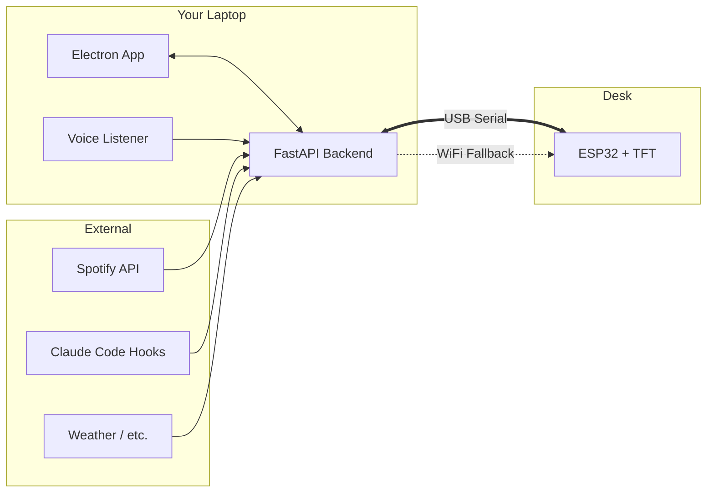
```mermaid
graph LR
    subgraph "Your Laptop"
        EA[Electron App]
        BE[FastAPI Backend]
        VC[Voice Listener]
    end

    subgraph "External"
        SP[Spotify API]
        CC[Claude Code Hooks]
        WX[Weather / etc.]
    end

    subgraph "Desk"
        ESP[ESP32 + TFT]
    end

    EA <--> BE
    VC --> BE
    SP --> BE
    CC --> BE
    WX --> BE
    BE <==USB Serial==> ESP
    BE -.WiFi Fallback.-> ESP
```

The FastAPI backend is the single brain. Everything flows through it. The ESP32 is a pure rendering surface.

---

## The Three-Layer Pipeline

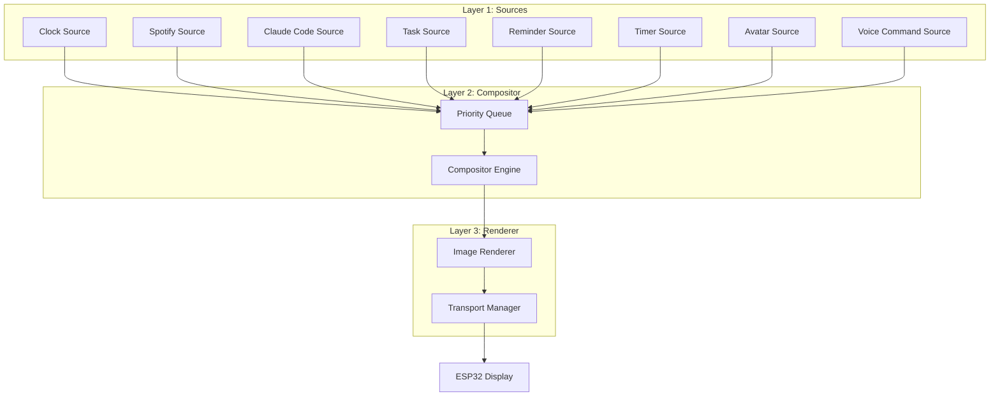
```mermaid
graph TB
    subgraph "Layer 1: Sources"
        S1[Clock Source]
        S2[Spotify Source]
        S3[Claude Code Source]
        S4[Task Source]
        S5[Reminder Source]
        S6[Timer Source]
        S7[Avatar Source]
        S8[Voice Command Source]
    end

    subgraph "Layer 2: Compositor"
        Q[Priority Queue]
        C[Compositor Engine]
    end

    subgraph "Layer 3: Renderer"
        R[Image Renderer]
        T[Transport Manager]
    end

    S1 & S2 & S3 & S4 & S5 & S6 & S7 & S8 --> Q
    Q --> C
    C --> R
    R --> T
    T --> ESP[ESP32 Display]
```

**Sources** produce structured data. **Compositor** decides what wins. **Renderer** turns the winner into pixels and ships them.

---

## Layer 1 — Sources

Each source is an independent module that produces `DisplayRequest` objects. A source knows nothing about other sources, rendering, or transport.

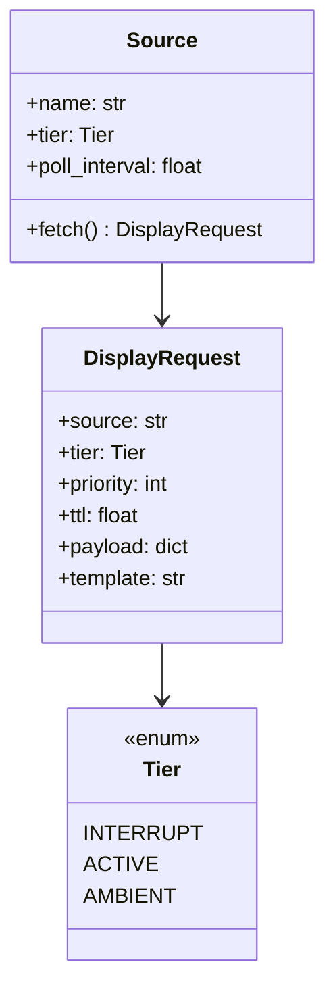
```mermaid
classDiagram
    class Source {
        +name: str
        +tier: Tier
        +poll_interval: float
        +fetch() DisplayRequest
    }

    class DisplayRequest {
        +source: str
        +tier: Tier
        +priority: int
        +ttl: float
        +payload: dict
        +template: str
    }

    class Tier {
        <<enum>>
        INTERRUPT
        ACTIVE
        AMBIENT
    }

    Source --> DisplayRequest
    DisplayRequest --> Tier
```

### Source Catalog

| Source | Tier | Trigger | Notes |
|--------|------|---------|-------|
| Clock | Ambient | Every 30s | Fallback default |
| Spotify | Ambient | Poll 5s when playing | Skip polls when idle |
| Weather | Ambient | Poll 15min | Cache aggressively |
| Task | Active | On change | From existing system |
| Timer | Active | On tick (1s while running) | From existing system |
| Avatar | Active | On voice/event trigger | Existing behavior preserved |
| Reminder | Interrupt | On fire | From existing system |
| Claude Code | Interrupt | On hook webhook | New integration |
| Voice Command | Active | On voice event | Existing system |

### Source Lifecycle

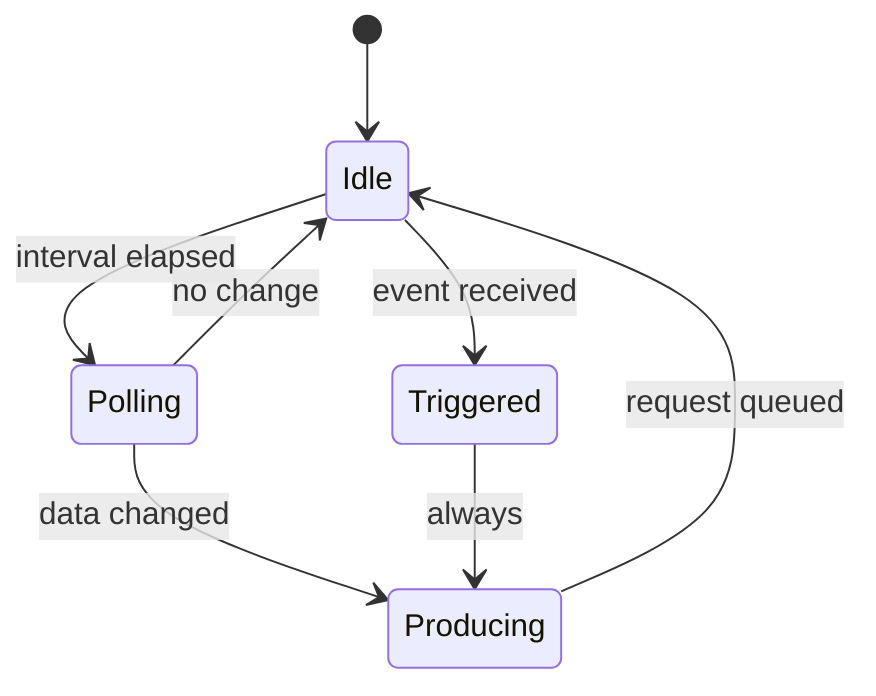
```mermaid
stateDiagram-v2
    [*] --> Idle
    Idle --> Polling: interval elapsed
    Idle --> Triggered: event received
    Polling --> Producing: data changed
    Polling --> Idle: no change
    Triggered --> Producing: always
    Producing --> Idle: request queued
```

**Token efficiency rule:** Sources only emit `DisplayRequest` when their data actually changes. A Spotify source polling every 5s that returns the same track emits *nothing*. This prevents redundant renders downstream.

---

## Layer 2 — The Compositor

The compositor is the one piece that doesn't exist in your current stack. Get this right and everything else falls into place.

### The Three Tiers

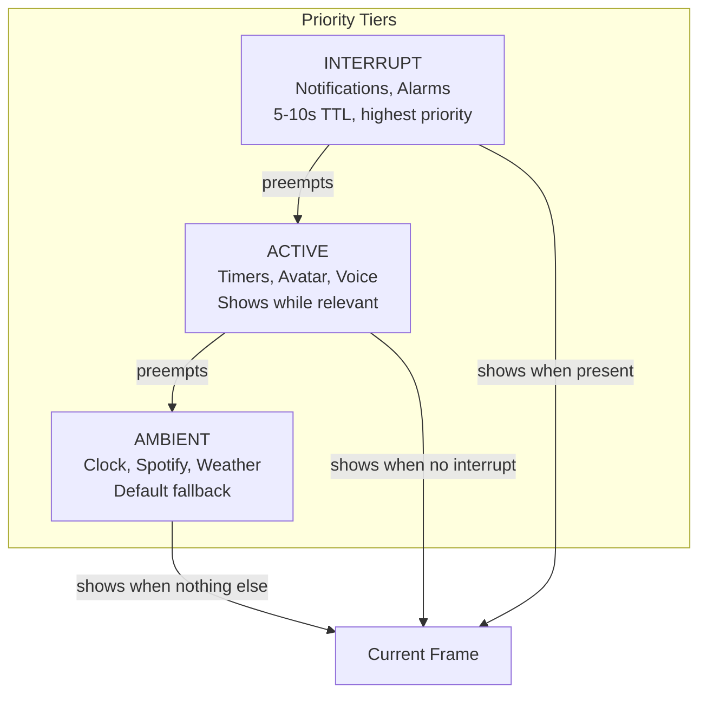
```mermaid
graph TB
    subgraph "Priority Tiers"
        I[INTERRUPT<br/>Notifications, Alarms<br/>5-10s TTL, highest priority]
        A[ACTIVE<br/>Timers, Avatar, Voice<br/>Shows while relevant]
        AM[AMBIENT<br/>Clock, Spotify, Weather<br/>Default fallback]
    end

    I -->|preempts| A
    A -->|preempts| AM
    AM -->|shows when nothing else| Screen[Current Frame]
    A -->|shows when no interrupt| Screen
    I -->|shows when present| Screen
```

### Decision Flow Per Tick

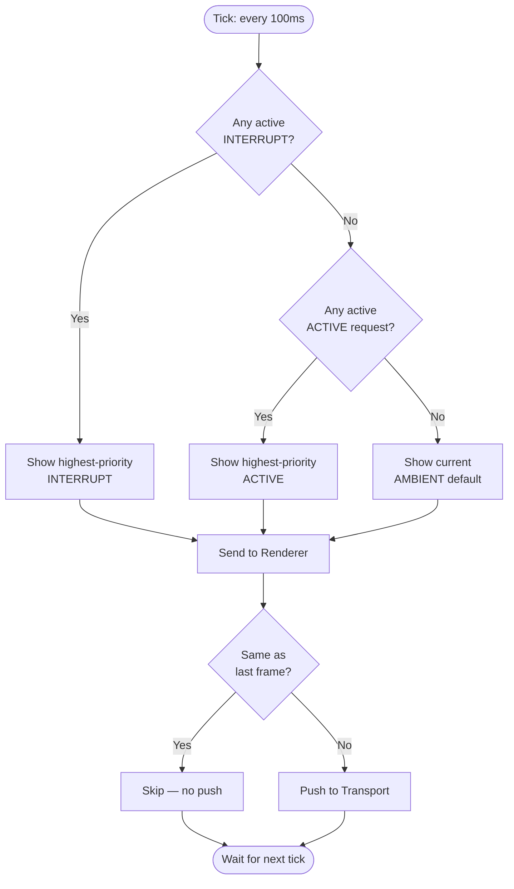
```mermaid
flowchart TD
    Start([Tick: every 100ms]) --> Q{Any active<br/>INTERRUPT?}
    Q -->|Yes| I[Show highest-priority<br/>INTERRUPT]
    Q -->|No| A{Any active<br/>ACTIVE request?}
    A -->|Yes| AC[Show highest-priority<br/>ACTIVE]
    A -->|No| AM[Show current<br/>AMBIENT default]
    I --> Render[Send to Renderer]
    AC --> Render
    AM --> Render
    Render --> Diff{Same as<br/>last frame?}
    Diff -->|Yes| Skip[Skip — no push]
    Diff -->|No| Push[Push to Transport]
    Skip --> End([Wait for next tick])
    Push --> End
```

**Token efficiency rule — critical:** The compositor computes a hash of the current intended frame. If the hash matches the last pushed frame, it skips the push entirely. This is what keeps the pipeline from flooding the wire when nothing visually changed.

### Preemption and Return

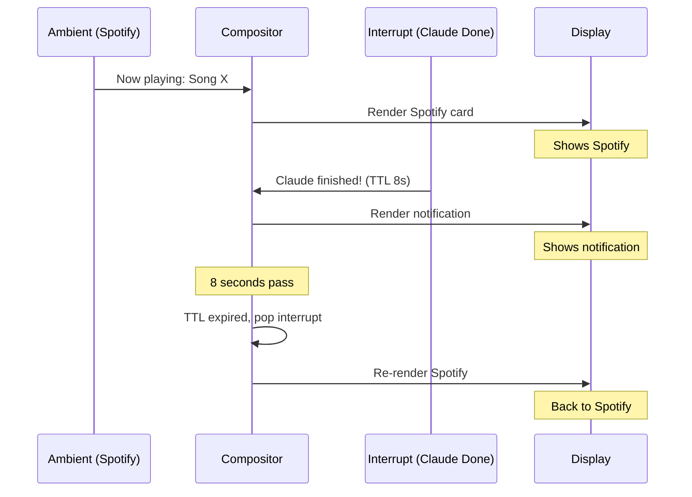
```mermaid
sequenceDiagram
    participant AM as Ambient (Spotify)
    participant C as Compositor
    participant I as Interrupt (Claude Done)
    participant D as Display

    AM->>C: Now playing: Song X
    C->>D: Render Spotify card
    Note over D: Shows Spotify
    I->>C: Claude finished! (TTL 8s)
    C->>D: Render notification
    Note over D: Shows notification
    Note over C: 8 seconds pass
    C->>C: TTL expired, pop interrupt
    C->>D: Re-render Spotify
    Note over D: Back to Spotify
```

### Request Lifecycle Inside Compositor

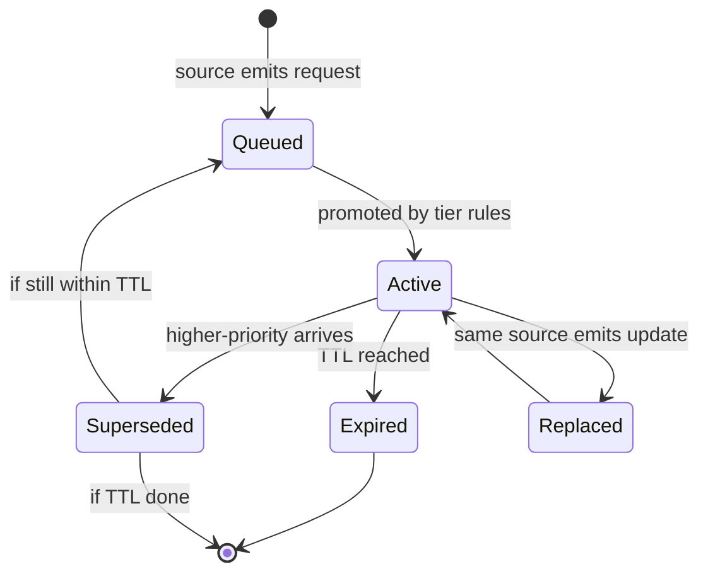
```mermaid
stateDiagram-v2
    [*] --> Queued: source emits request
    Queued --> Active: promoted by tier rules
    Active --> Expired: TTL reached
    Active --> Superseded: higher-priority arrives
    Active --> Replaced: same source emits update
    Replaced --> Active
    Expired --> [*]
    Superseded --> Queued: if still within TTL
    Superseded --> [*]: if TTL done
```

---

## Layer 3 — The Renderer

Takes the winning `DisplayRequest` and produces a 240×320 image, then hands it to the transport manager.

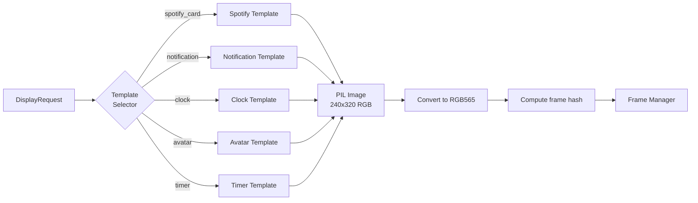
```mermaid
graph LR
    DR[DisplayRequest] --> TS{Template<br/>Selector}
    TS -->|spotify_card| TC1[Spotify Template]
    TS -->|notification| TC2[Notification Template]
    TS -->|clock| TC3[Clock Template]
    TS -->|avatar| TC4[Avatar Template]
    TS -->|timer| TC5[Timer Template]
    TC1 & TC2 & TC3 & TC4 & TC5 --> IMG[PIL Image<br/>240x320 RGB]
    IMG --> CV[Convert to RGB565]
    CV --> HASH[Compute frame hash]
    HASH --> FM[Frame Manager]
```

### Template Design

Each template is a pure function: `payload -> PIL.Image`. No side effects, no external calls. Easy to test, cache, and iterate on.

**Token efficiency rule:** Templates should cache invariant pieces. The Spotify template's background gradient doesn't change — render it once, keep it in memory, overlay the dynamic parts per frame.

### Optional: Dirty-Rect Optimization (Later)

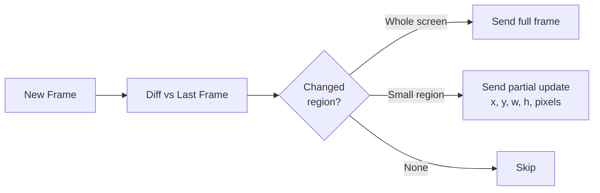
```mermaid
graph LR
    N[New Frame] --> D[Diff vs Last Frame]
    D --> R{Changed<br/>region?}
    R -->|Whole screen| F[Send full frame]
    R -->|Small region| P[Send partial update<br/>x, y, w, h, pixels]
    R -->|None| S[Skip]
```

Don't build this first. Add it only if full-frame pushes feel slow after everything else works.

---

## Transport Layer — USB Primary, WiFi Fallback

This is how frames physically get to the ESP32.

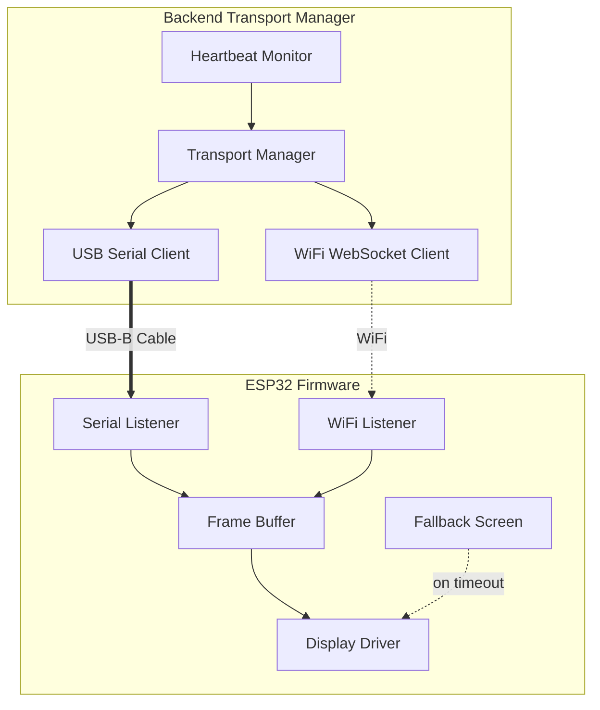
```mermaid
graph TB
    subgraph "Backend Transport Manager"
        TM[Transport Manager]
        US[USB Serial Client]
        WS[WiFi WebSocket Client]
        HB[Heartbeat Monitor]
    end

    subgraph "ESP32 Firmware"
        SL[Serial Listener]
        WL[WiFi Listener]
        FB[Frame Buffer]
        DR[Display Driver]
        FS[Fallback Screen]
    end

    TM --> US
    TM --> WS
    HB --> TM
    US ==USB-B Cable==> SL
    WS -.WiFi.-> WL
    SL --> FB
    WL --> FB
    FB --> DR
    FS -.on timeout.-> DR
```

### Transport Selection Logic

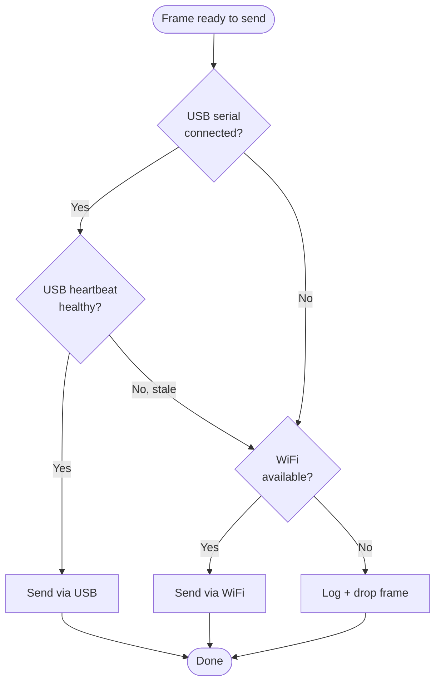
```mermaid
flowchart TD
    Start([Frame ready to send]) --> U{USB serial<br/>connected?}
    U -->|Yes| UH{USB heartbeat<br/>healthy?}
    U -->|No| W{WiFi<br/>available?}
    UH -->|Yes| SendU[Send via USB]
    UH -->|No, stale| W
    W -->|Yes| SendW[Send via WiFi]
    W -->|No| Log[Log + drop frame]
    SendU --> Done([Done])
    SendW --> Done
    Log --> Done
```

### Heartbeat Pattern

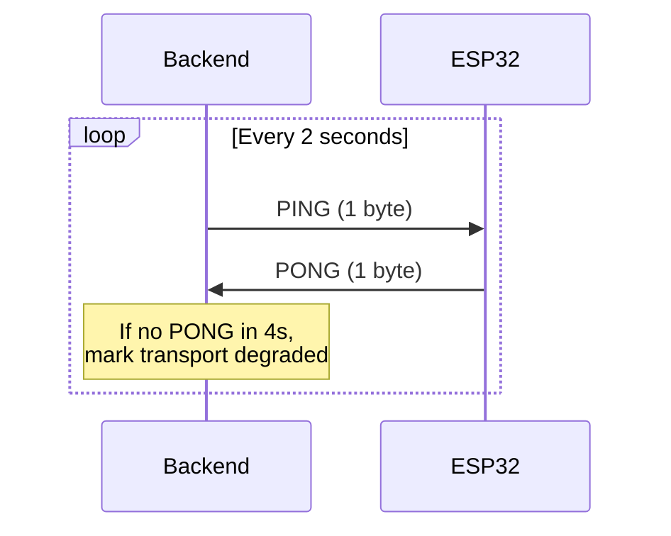
```mermaid
sequenceDiagram
    participant BE as Backend
    participant ESP as ESP32

    loop Every 2 seconds
        BE->>ESP: PING (1 byte)
        ESP->>BE: PONG (1 byte)
        Note over BE: If no PONG in 4s,<br/>mark transport degraded
    end
```

The backend runs heartbeats on *both* transports independently. Health state is per-transport, not global.

### ESP32 Failover Behavior

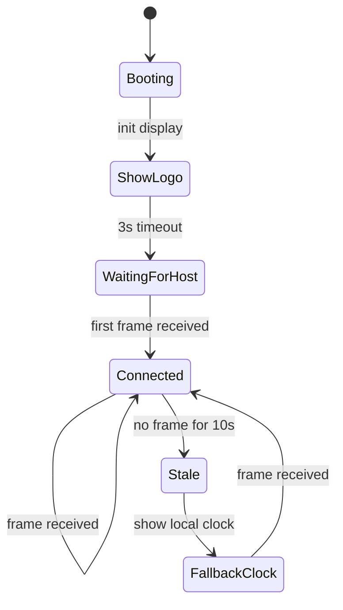
```mermaid
stateDiagram-v2
    [*] --> Booting
    Booting --> ShowLogo: init display
    ShowLogo --> WaitingForHost: 3s timeout
    WaitingForHost --> Connected: first frame received
    Connected --> Connected: frame received
    Connected --> Stale: no frame for 10s
    Stale --> FallbackClock: show local clock
    FallbackClock --> Connected: frame received
```

**Token efficiency rule:** USB serial is cheaper in latency but narrower in bandwidth than WiFi. For 240×320 at 2-5 FPS ambient refresh, USB is more than enough. Reserve WiFi for cases where USB is actually unavailable.

---

## Wire Protocol

Keep it minimal. One-byte command prefix, then payload. Same format over USB and WiFi.

| Command | Byte | Payload | Direction |
|---------|------|---------|-----------|
| PING | 0x01 | none | BE → ESP |
| PONG | 0x02 | none | ESP → BE |
| FULL_FRAME | 0x10 | 153600 bytes RGB565 | BE → ESP |
| PARTIAL_FRAME | 0x11 | x, y, w, h, pixels | BE → ESP (later) |
| CLEAR | 0x20 | color (2 bytes) | BE → ESP |
| BRIGHTNESS | 0x30 | level (1 byte) | BE → ESP |
| EVENT | 0x40 | event_id (1 byte) | ESP → BE (future buttons) |

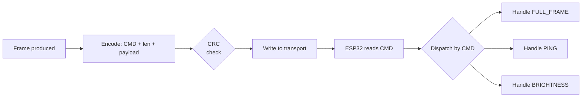
```mermaid
graph LR
    F[Frame produced] --> E[Encode: CMD + len + payload]
    E --> C{CRC<br/>check}
    C --> W[Write to transport]
    W --> R[ESP32 reads CMD]
    R --> D{Dispatch by CMD}
    D --> FR[Handle FULL_FRAME]
    D --> PG[Handle PING]
    D --> BR[Handle BRIGHTNESS]
```

---

## Integration With Existing Systems

### Avatar System Migration

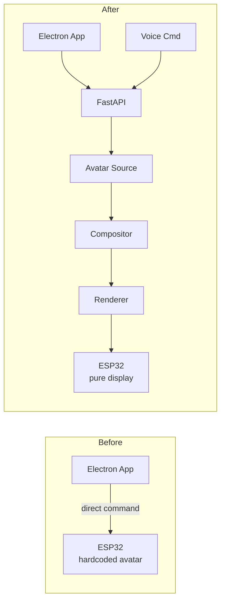
```mermaid
graph LR
    subgraph "Before"
        EA1[Electron App] -->|direct command| ESP1[ESP32<br/>hardcoded avatar]
    end

    subgraph "After"
        EA2[Electron App] --> BE2[FastAPI]
        VC2[Voice Cmd] --> BE2
        BE2 --> AS[Avatar Source]
        AS --> COM[Compositor]
        COM --> REN[Renderer]
        REN --> ESP2[ESP32<br/>pure display]
    end
```

Avatars now render as server-side templates. Same visual result, but now composable with notifications and other content.

### Voice Command Flow (After)

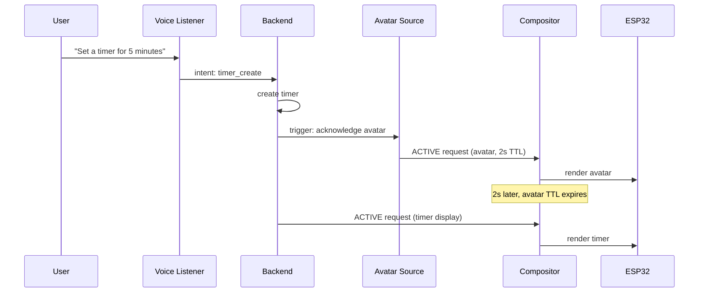
```mermaid
sequenceDiagram
    participant U as User
    participant V as Voice Listener
    participant BE as Backend
    participant AS as Avatar Source
    participant C as Compositor
    participant ESP as ESP32

    U->>V: "Set a timer for 5 minutes"
    V->>BE: intent: timer_create
    BE->>BE: create timer
    BE->>AS: trigger: acknowledge avatar
    AS->>C: ACTIVE request (avatar, 2s TTL)
    C->>ESP: render avatar
    Note over C: 2s later, avatar TTL expires
    BE->>C: ACTIVE request (timer display)
    C->>ESP: render timer
```

### Claude Code Hook Flow

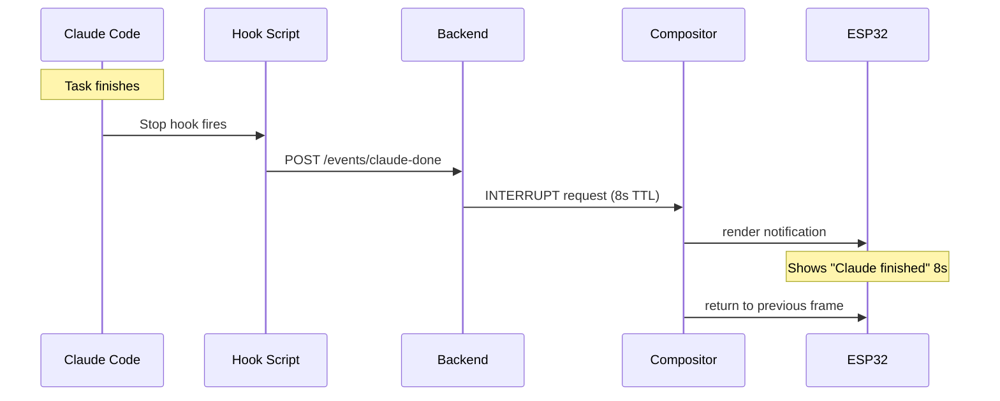
```mermaid
sequenceDiagram
    participant CC as Claude Code
    participant H as Hook Script
    participant BE as Backend
    participant C as Compositor
    participant ESP as ESP32

    Note over CC: Task finishes
    CC->>H: Stop hook fires
    H->>BE: POST /events/claude-done
    BE->>C: INTERRUPT request (8s TTL)
    C->>ESP: render notification
    Note over ESP: Shows "Claude finished" 8s
    C->>ESP: return to previous frame
```

---

## Migration Order

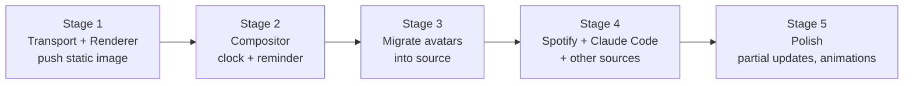
```mermaid
graph LR
    S1[Stage 1<br/>Transport + Renderer<br/>push static image] --> S2[Stage 2<br/>Compositor<br/>clock + reminder]
    S2 --> S3[Stage 3<br/>Migrate avatars<br/>into source]
    S3 --> S4[Stage 4<br/>Spotify + Claude Code<br/>+ other sources]
    S4 --> S5[Stage 5<br/>Polish<br/>partial updates, animations]
```

| Stage | Goal | Success Criteria |
|-------|------|------------------|
| 1 | Backend can push a 240×320 image to ESP32 via USB, WiFi fallback works | Hello world image renders, unplug USB → WiFi takes over |
| 2 | Two-source compositor with priority | Clock shows, reminder interrupts for 8s, clock returns |
| 3 | Avatar system moved to source model | Voice command triggers avatar via compositor, old direct path retired |
| 4 | All target use cases live | Spotify, Claude Code, weather, timer all work |
| 5 | Optimize | Frame diffing, partial updates, smooth transitions |

---

## Token Efficiency Playbook

A consolidated list of the rules applied throughout:

1. **Skip unchanged frames.** Hash the frame, don't push duplicates.
2. **Sources stay silent when idle.** No "still the same" updates.
3. **Cache template invariants.** Backgrounds, fonts, static layers live in memory.
4. **Poll slowest rate that feels live.** Spotify 5s, weather 15min, clock 30s.
5. **USB first.** Lower overhead than WiFi for short frames.
6. **Ambient tier, low refresh.** 1 FPS is fine for a clock.
7. **Active tier, medium refresh.** 2-5 FPS for timers, avatars.
8. **Interrupt tier, full-fidelity.** Pay the cost for the 5-10s it's on screen.
9. **Short wire protocol.** 1-byte commands, no JSON overhead on hot path.
10. **Defer partial updates.** Only build dirty-rect logic if you measure it's needed.

---

## Setup Steps — Your Side

Everything you need to do before writing the new pipeline code. Do these in order.

### 1. ESP32 Firmware Preparation

- [ ] Confirm the TFT driver chip — likely ILI9341 on a 2.8" 240×320 SPI module. Check the back of the board.
- [ ] Install **LovyanGFX** library in your Arduino/PlatformIO environment (better DMA support than TFT_eSPI for your use case).
- [ ] Wire the TFT to ESP32 using hardware SPI pins for your board variant. Record the pinout — you'll need it in firmware config.
- [ ] Run LovyanGFX's built-in example sketch to confirm the panel works with a color gradient. Don't move forward until this works.
- [ ] Note your ESP32's MAC address (printed via `WiFi.macAddress()`) — useful for router reservations.

### 2. Network Configuration

- [ ] Decide WiFi SSID + password the ESP32 will use. Ideally same network as your laptop.
- [ ] Reserve a static IP for the ESP32 in your router's DHCP table, OR plan to use mDNS (`deskbot.local`).
- [ ] Confirm your laptop's firewall allows inbound connections on the port you'll pick (suggest 3456 for frames, 3457 for events).
- [ ] Test that laptop and ESP32 can ping each other once ESP32 is online.

### 3. USB Serial Setup

- [ ] Install the CP2102 or CH340 USB-to-serial driver on your laptop if not already present (depends on your ESP32 board).
- [ ] Find the serial device path: `/dev/ttyUSB0` or `/dev/ttyACM0` on Linux, `COMx` on Windows, `/dev/cu.usbserial-*` on macOS.
- [ ] Confirm you can open the port at 921600 baud (highest stable rate for bulk frame transfer) — test with `screen`, `minicom`, or Arduino Serial Monitor.
- [ ] Add your user to the `dialout` group (Linux) so FastAPI can open the port without sudo.

### 4. Backend Environment

- [ ] Create a new FastAPI module/subpackage for the display pipeline (suggest `backend/display/`).
- [ ] Add Python dependencies to your project: `pillow`, `pyserial`, `websockets`, `spotipy`, `numpy` (for fast RGB565 conversion).
- [ ] Plan directory structure: `display/sources/`, `display/compositor.py`, `display/renderer.py`, `display/templates/`, `display/transport.py`.
- [ ] Pick a font file (e.g., Inter, JetBrains Mono) and drop it into `display/assets/fonts/`. Small displays need thoughtful type choices.

### 5. Spotify Integration Prep

- [ ] Create an app at https://developer.spotify.com/dashboard to get a Client ID and Client Secret.
- [ ] Set redirect URI to `http://localhost:8888/callback` (or whatever your FastAPI exposes).
- [ ] Store credentials in your existing `.env` or secrets setup.
- [ ] Run a one-time OAuth flow with `spotipy` to generate the refresh token — this is manual and only needs to happen once.

### 6. Claude Code Hook Prep

- [ ] Locate your Claude Code settings file (typically `~/.claude/settings.json` or project-level `.claude/settings.json`).
- [ ] Decide on a local webhook endpoint in FastAPI (suggest `POST /events/claude-done`).
- [ ] Plan to add `Stop` and `Notification` hooks that call a tiny shell script which `curl`s your FastAPI endpoint with the event payload.

### 7. Electron App Adjustments

- [ ] Identify the current code path where the Electron app sends avatar commands directly. Mark it for later rerouting through FastAPI.
- [ ] Plan a new IPC channel or HTTP call pattern: Electron → FastAPI → compositor → ESP32. Old direct path gets retired in Stage 3.
- [ ] No UI changes needed right now — the app keeps looking the same to you.

### 8. Project Hygiene

- [ ] Create a new branch: `feature/dynamic-display`.
- [ ] Add a `README_display.md` to your repo that links back to this plan.
- [ ] Set up a `display/templates/_test_harness.py` pattern early — render templates to PNG files on disk during development so you can iterate without an ESP32 in the loop.
- [ ] Decide on logging: suggest a dedicated logger namespace `display.*` so you can tune verbosity per layer.

### 9. Sanity Checklist Before Stage 1

Before writing any new pipeline code, confirm:
- [ ] LovyanGFX color gradient runs on the TFT.
- [ ] ESP32 appears as a serial device and you can open it at 921600 baud.
- [ ] ESP32 joins WiFi and pings laptop successfully.
- [ ] FastAPI runs and you can hit it from Electron.
- [ ] Spotify credentials are loaded and `sp.current_playback()` returns valid data.
- [ ] You can write a dummy 240×320 PNG with Pillow and save it to disk.

Once all nine sections are complete, you're set up to start Stage 1 — pushing your first dynamically-generated image to the ESP32.

---

## Reference — Full System After Completion

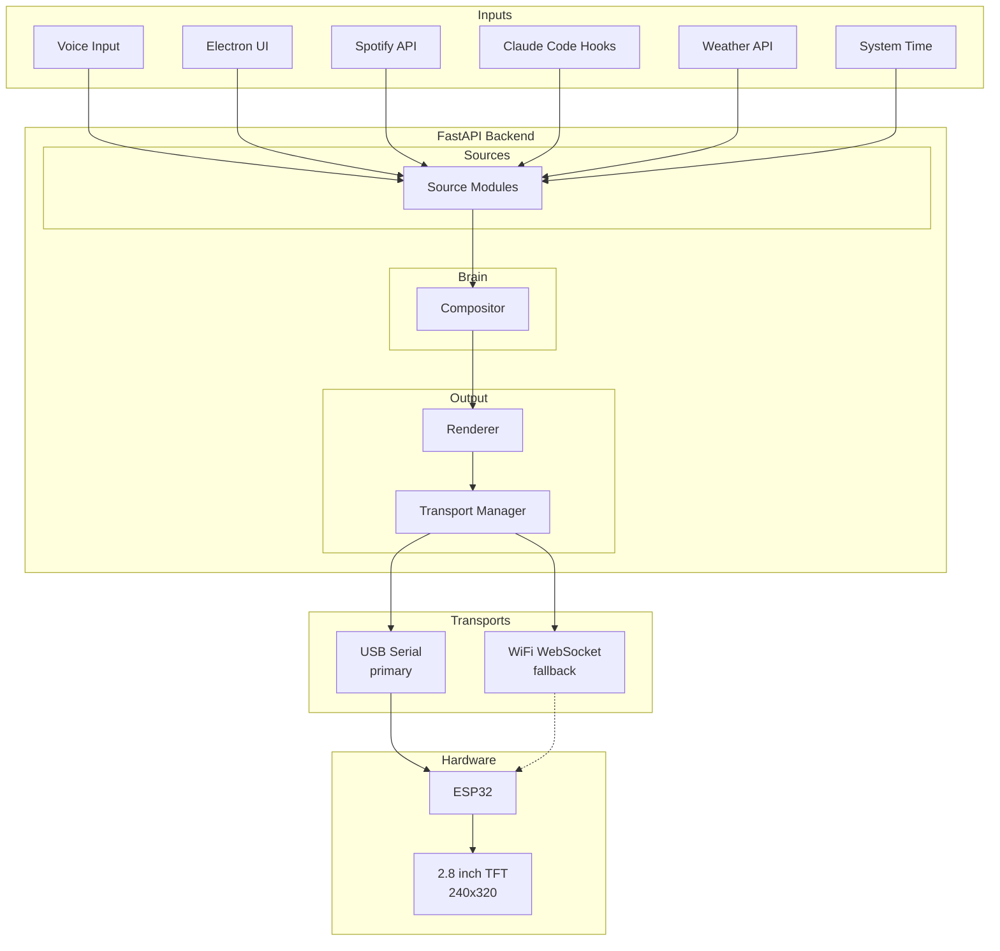
```mermaid
graph TB
    subgraph "Inputs"
        VI[Voice Input]
        EI[Electron UI]
        SP[Spotify API]
        CC[Claude Code Hooks]
        WX[Weather API]
        TM[System Time]
    end

    subgraph "FastAPI Backend"
        subgraph "Sources"
            SRC[Source Modules]
        end
        subgraph "Brain"
            COMP[Compositor]
        end
        subgraph "Output"
            REN[Renderer]
            TR[Transport Manager]
        end
    end

    subgraph "Transports"
        USB[USB Serial<br/>primary]
        WIFI[WiFi WebSocket<br/>fallback]
    end

    subgraph "Hardware"
        ESP[ESP32]
        TFT[2.8 inch TFT<br/>240x320]
    end

    VI & EI & SP & CC & WX & TM --> SRC
    SRC --> COMP
    COMP --> REN
    REN --> TR
    TR --> USB
    TR --> WIFI
    USB --> ESP
    WIFI -.-> ESP
    ESP --> TFT
```

This is the end state. Every future use case is one new source away.
